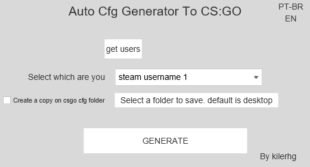

# CFG GENERATOR CSGO

## Descrição

A CS:GO cfg generator

## Como Usar

### Instalando

Instalar Requisitos:
```pip install requirements.txt```

## Abrindo

Abrir o Cmd ou PowerShell Na pasta e rodar o comando: ```python main.py```

## Task-List

- [x] Desenvolver a ideia
- [x] Prototipagem
- [ ] Estudo biblioteca OS
- [ ] criar funções que buscam nomes e pastas e arquivos
- [ ] criar funções que mandar e recebam requests com nomes
- [ ] limpar dados e separar
- [ ] criar interface basica
- [ ] criar ligação entre back e front
- [ ] Lapidar projeto
- [ ] Compilar para .EXE


## Screenshot


